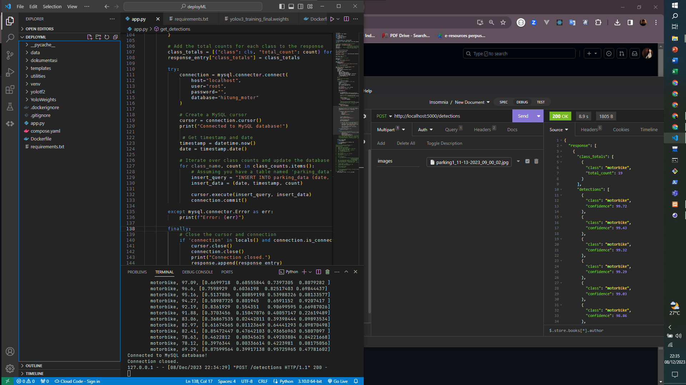
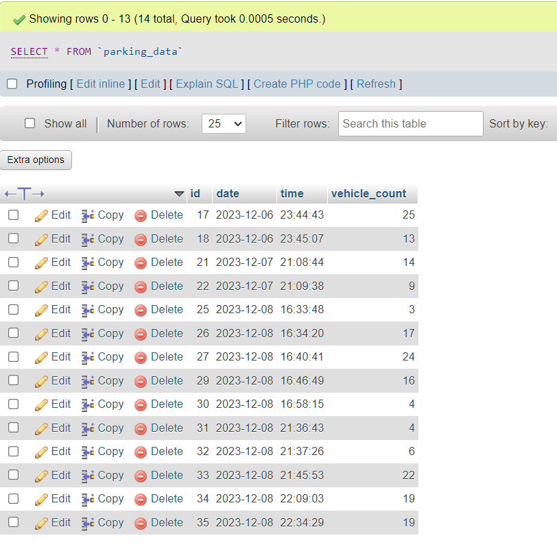

# deploy-parking-models

Training Transfer Learning menggunakan YoloV3 darknet :
https://github.com/C23CA01/IoTCameraAnalytics/tree/deploy-parking-ML

YoloV3 darknet yang di latih dari custom dataset di convert ke tensorflow format(.h5):
https://drive.google.com/drive/folders/1P0dMxlv87aGx2GUUwvt57ZJt6G7J4e-j?usp=sharing

## 1. Uji API predict image secara local

### 1.2 Contoh database jika script capture bekerja otomatis untuk memasuki prediksi model :

